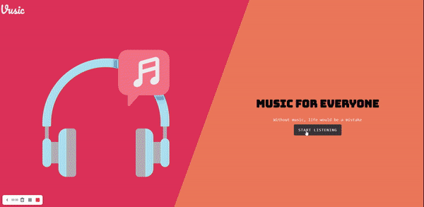
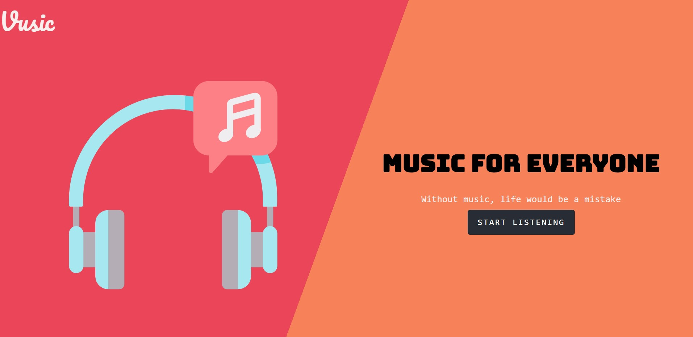
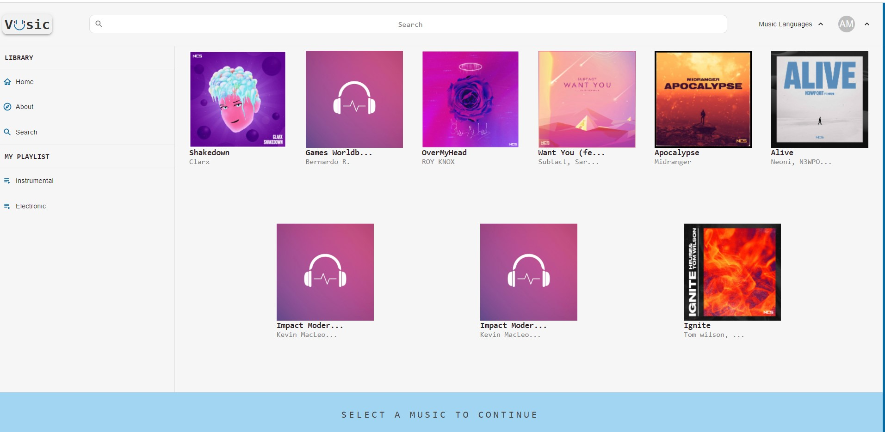
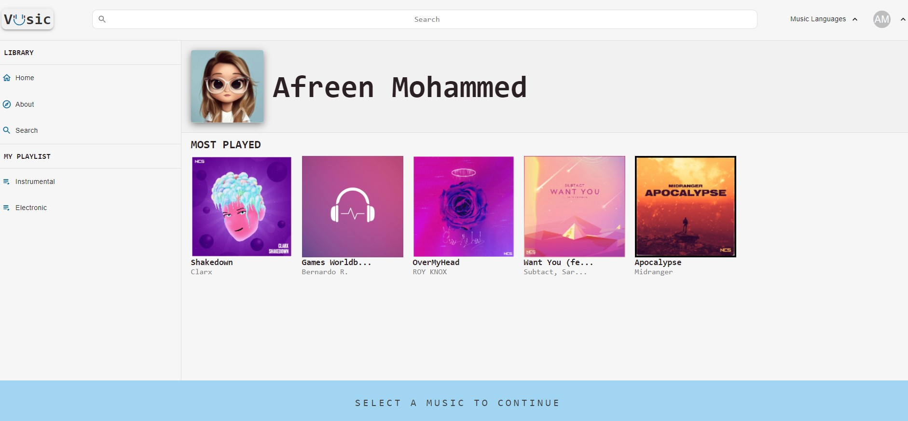

# MUSIC APPLICATION IN REACT JS

This is a music app made in react. It is the one stop music destination you wished for.

## Table of Content 

* [Introduction](#introduction)
* [Description](#description)
* [Demo](demo)
* [Screenshots](screenshots)
* [Compentencies](#compentencies)
* [Technologies](#technologies)
* [Attributions](attributions)
* [Setup](setup)
* [Features](#features)
* [Stretch_Goals](#stretch-goals)
* [Contact](#contact)

## Introduction 
This is a music app made in react. It is the one stop music destination you wished for.

---

## Description:

- Through this app, a user can listen to the music. Select the music type.
- A user can search for the music from search box.
- A user can login into the music app and add the favorite music.
- A user can view the most played music.
most played music

## Demo

<h1 align="center">
   Vusic | The music destination you want.
</h1>

 A music app made with the help of React.js.
    

---

## Screenshots

---

## Compentencies

* JF 2.2
Understands how to create and analyze artifacts, such as use cases and/or user stories
* JF 3.4
Able to create simple software designs to effectively communicate an understanding of the program

---

## Technologies
- React
- CSS
- Material UI
- Git 
- GitHub 
- Bootstrap
- Netlify

* [React.js](https://reactjs.org/)
    * ###### [react-router](https://github.com/ReactTraining/react-router#readme)
    * ###### [react-redux](https://react-redux.js.org/)
    * ###### [material-ui/core](https://www.npmjs.com/package/@material-ui/core)
    * ###### [material-ui/icons](https://www.npmjs.com/package/@material-ui/icons)
    * ###### [context API](https://reactjs.org/docs/context.html)
    * ###### [scss](https://sass-lang.com/)
   

---

## Attribution
    
[Icons](www.flaticon.com) made by Freepikfrom 

[Music](https://ncs.io/music) by NCS

---

## Setup
- Fork the repository
- Clone 
- npm install 
- npm start

---

## Features
- Play/Search/Favorite music
- View collection of music and select the music type.
- View the most played music from the list.

## Stretch-Goals
- Registration and login
- User can recommend music to others by sharing through social media.
- Allow user to like, comment and share.
- Allow user to download their favorite music.
- To choose music language.

---
                 
## Contact
- [Afreen](https://github.com/afreensafdar)

---

